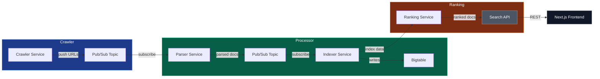

# Distributed Search Engine

[](LICENSE)  
[](https://github.com/mhtpsd/Distributed-Search-Engine/actions)

---

## Table of Contents

- [Introduction](#introduction)
- [Features](#features)
- [Architecture Overview](#architecture-overview)
- [Tech Stack](#tech-stack)
- [Getting Started](#getting-started)
  - [Prerequisites](#prerequisites)
  - [Installation](#installation)
  - [Running Locally](#running-locally)
  - [Running Tests](#running-tests)
  - [Deployment](#deployment)
- [Project Structure](#project-structure)
- [Contributing](#contributing)
- [License](#license)
- [Security](#security)
- [Development vs Production](#development-vs-production)
- [Contact](#contact)

---

## Introduction

**Distributed Search Engine** is a production‑ready, horizontally scalable search platform built on **Google Cloud Platform (GCP)**. It ingests raw web data, parses and indexes it, ranks results with relevance models, and serves fast, low‑latency queries through a modern **Next.js** UI.

The project showcases best‑in‑class cloud‑native patterns: micro‑services, event‑driven pipelines, container orchestration, CI/CD, and observability. It is ideal for recruiters or engineers looking for a sophisticated, end‑to‑end example of a large‑scale search system.

---

## Features

- **Distributed crawling** with parallel workers using GCP Pub/Sub.
- **Robust parsing** of HTML, PDF, and plain‑text documents.
- **Scalable indexing** on Cloud Bigtable with automatic sharding.
- **Custom ranking** using TF‑IDF and BM25 algorithms, extensible to ML models.
- **RESTful Search API** (Java Spring Boot) with pagination, faceting, and typo‑tolerance.
- **Responsive UI** built with Next.js, TailwindCSS, and dynamic data visualisation.
- **CI/CD pipeline** (GitHub Actions) that builds Docker images, runs tests, and deploys to Cloud Run/Kubernetes.
- **Observability** via Cloud Monitoring, Logging, and OpenTelemetry tracing.

---

## Architecture Overview



The diagram illustrates the event‑driven pipeline: the **Crawler** publishes raw URLs to Pub/Sub, the **Parser** extracts content, the **Indexer** stores term vectors in Bigtable, the **Ranking** service computes relevance scores, and the **Search API** serves results to the **Next.js** frontend.

---

## Tech Stack

| Layer | Technology | Reason |
|-------|------------|--------|
| **Language** | Java 21 (Spring Boot) | Mature ecosystem, high performance, strong typing |
| **Frontend** | Next.js (React) + TailwindCSS | Server‑side rendering, fast UI, modern styling |
| **Message Bus** | Google Pub/Sub | Fully managed, at‑least‑once delivery |
| **Storage** | Cloud Bigtable | Low‑latency key‑value store, scalable for billions of rows |
| **Containerisation** | Docker + Cloud Run / GKE | Consistent runtime, auto‑scaling |
| **CI/CD** | GitHub Actions | Automated builds, tests, and deployments |
| **Observability** | Cloud Monitoring, OpenTelemetry | End‑to‑end tracing and metrics |
| **Infrastructure as Code** | Terraform | Declarative, reproducible GCP resources |
| **Testing** | JUnit 5, Testcontainers, Cypress | Unit, integration, and end‑to‑end tests |

---

## Getting Started

### Prerequisites

- **Java 21** (or later) and **Maven**
- **Node.js 20+** and **npm**
- **Docker Desktop** (or Docker Engine) for local container builds
- **Google Cloud SDK** (`gcloud`) with a project you own
- **Terraform 1.6+**
- **Git**

### Installation

```bash
# Clone the repository
git clone https://github.com/mhtpsd/Distributed-Search-Engine.git
cd Distributed-Search-Engine

# Backend (Java services)
cd backend
mvn clean install

# Frontend (Next.js)
cd ../frontend
npm install
```

### Running Locally

1. **Start Pub/Sub emulator** (optional, for full local stack):
   ```bash
   gcloud beta emulators pubsub start --host-port=localhost:8085
   export PUBSUB_EMULATOR_HOST=localhost:8085
   ```
2. **Run Bigtable emulator** (or use a real instance):
   ```bash
   docker run -d -p 8086:8086 google/cloud-sdk:emulators gcloud beta emulators bigtable start --host-port=0.0.0.0:8086
   export BIGTABLE_EMULATOR_HOST=localhost:8086
   ```
3. **Start services** (each in its own terminal):
   ```bash
   # Crawler
   cd backend/crawler && mvn spring-boot:run
   # Parser
   cd ../parser && mvn spring-boot:run
   # Indexer
   cd ../indexer && mvn spring-boot:run
   # Ranking
   cd ../ranking && mvn spring-boot:run
   # Search API
   cd ../search-api && mvn spring-boot:run
   ```
4. **Run the UI**:
   ```bash
   cd ../../frontend
   npm run dev
   ```
5. Open `http://localhost:3000` in your browser.

### Running Tests

```bash
# Backend unit & integration tests
cd backend && mvn test

# Frontend end‑to‑end tests (Cypress)
cd ../frontend && npx cypress run
```

### Deployment

The CI/CD workflow (`.github/workflows/ci.yml`) builds Docker images, pushes them to **Google Artifact Registry**, and deploys to **Cloud Run** (or GKE) using Terraform.

```bash
# Authenticate Docker with GCP
gcloud auth configure-docker <region>-docker.pkg.dev

# Deploy infrastructure
cd infra && terraform init && terraform apply
```

After Terraform finishes, the search API endpoint and the Next.js static site are publicly reachable.

---

## Project Structure

```
Distributed-Search-Engine/
├─ backend/                 # Java micro‑services (crawler, parser, indexer, ranking, api)
│   ├─ crawler/
│   ├─ parser/
│   ├─ indexer/
│   ├─ ranking/
│   └─ search-api/
├─ frontend/                # Next.js UI
│   ├─ pages/
│   ├─ components/
│   └─ styles/
├─ infra/                   # Terraform configuration for GCP resources
├─ docs/                    # Architecture diagrams, design docs
├─ .github/                 # GitHub Actions workflows
├─ .gitignore
├─ README.md                # ← This file
└─ pom.xml                  # Parent Maven pom
```

---

## License

Distributed Search Engine is released under the **MIT License**. See the [LICENSE](LICENSE) file for details.

---

## Security

- **Backend Cloud Run service** is protected by IAM authentication — it does **not** allow unauthenticated access. Callers must present a valid Google ID token (e.g. a service account with the `roles/run.invoker` role).
- **Secrets are injected via environment variables**. In production, values are sourced from GCP Secret Manager and surfaced as environment variables in Cloud Run — they are never baked into images or committed to source control.
- **Never commit credentials** (API keys, service account JSON, database passwords) to this repository.

---

## Development vs Production

This project uses Spring Boot profiles to separate local and production configuration:

| Profile | Description |
|---------|-------------|
| `dev` (default) | Uses an in-memory H2 database. No GCP credentials needed. Start with `mvn spring-boot:run`. |
| `prod` | Uses PostgreSQL. All sensitive values (`DB_URL`, `DB_USERNAME`, `DB_PASSWORD`) must be injected as environment variables — typically via GCP Secret Manager in Cloud Run. |

Set the active profile via the `SPRING_PROFILES_ACTIVE` environment variable:

```bash
# Local development (default)
mvn spring-boot:run

# Production simulation
SPRING_PROFILES_ACTIVE=prod DB_URL=... DB_USERNAME=... DB_PASSWORD=... mvn spring-boot:run
```

---

## Contact

- **Author**: Mohit – [mohitmanoj1704@gmail.com](mailto:mohitmanoj1704@gmail.com)
- **GitHub**: https://github.com/mhtpsd
- **LinkedIn**: https://www.linkedin.com/in/mohitprasadofficial/

---

*This README was crafted to give recruiters and engineers a comprehensive view of the project’s purpose, design, and how to get started quickly.*
